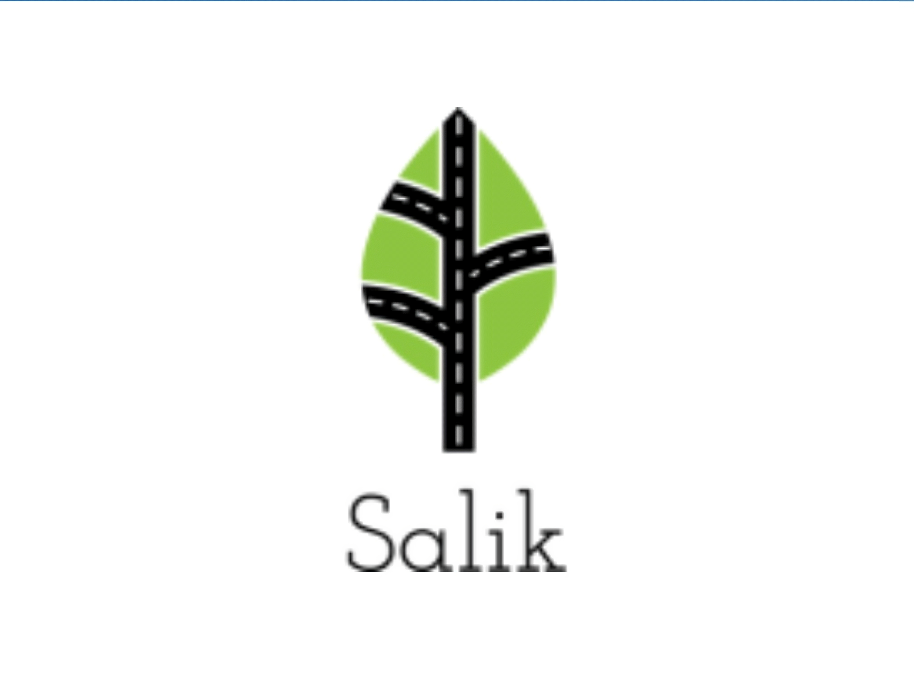

# 6- Capstone Proposal

Please edit this README.md file based on your Capstone project idea.

Project Title:
Salik (Detect visual Pollution in the road) 

Group Members:

- Ali Al mutairi
- Saleh Abdullah
- Abdullah Alajalin

Objectives:
Write your main goal behind this project and the objectives that you need to achieve your goal.
Dataset Description:

- The number of rows:
- The number of columns:
- Columns Description (meaning):
- The number of Missing values:

Dataset Link:
Note: you have to choose a real dataset that needs to clean and preprocess.
The expected (Machine learning / Deep Learning) Algorithms:
Write the algorithms that you will fit with your proposed solution.

Final Deliverables:
- README.md file.
- Due Date: Wed, 13 Dec, at 9:00 p.m.
