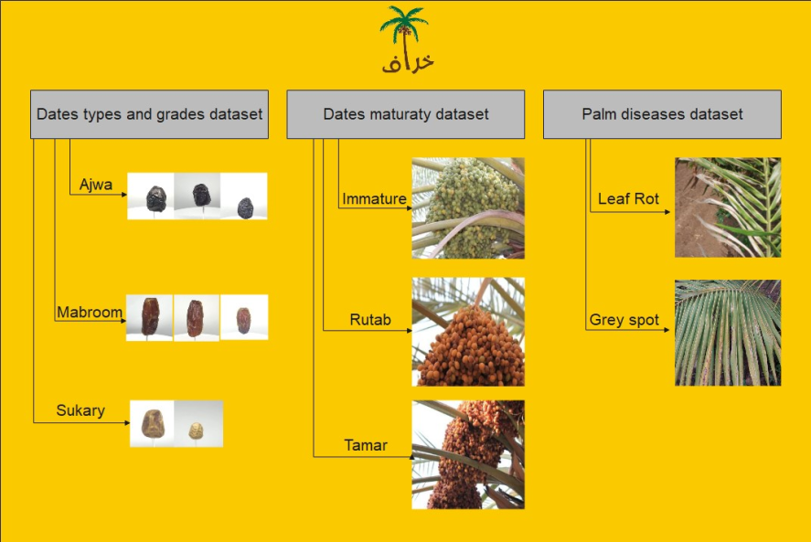
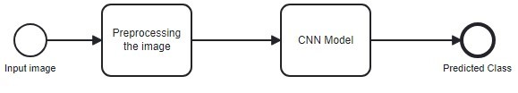

# 🌴 Kharaf: Your farming companion 🌴
## Description
Kharaf is an Image Classification project designed to assist in the classification of Date types, Maturity, and Grade, as well as the detection of diseases affecting Palm Trees. The project primarily utilizes Convolutional Neural Networks (CNNs) for image classification tasks.

## Features
- Date Classification: Identifies different types, maturity stages, and grades of dates through image classification using CNNs.
- Palm Tree Disease Detection: Utilizes CNN-based algorithms to identify diseases affecting Palm Trees from images.

## Technologies Used
- TensorFlow & Keras: Utilized for building and training Convolutional Neural Networks.
- Plotly Dash: Employed for the web application interface.

## Data Collection
The dataset used for training and evaluating the model is sourced from the following resources:
### Dataset Sources

1. **Date Fruit Dataset for Automated Harvesting and Visual Yield Estimation**

- Dataset Link: [ IEEE DataPort - Date Fruit Dataset ](https://ieee-dataport.org/open-access/date-fruit-dataset-automated-harvesting-and-visual-yield-estimation)
- Description: This dataset provides a collection of high-resolution images of date fruits captured for the purpose of automated harvesting and visual yield estimation. It includes a diverse range of date fruit images with varying backgrounds, lighting conditions, and orientations.

2. **TU-DG Dataset for Date Grading**
- Dataset Link: [IEEE DataPort - TU-DG Dataset](https://ieee-dataport.org/open-access/tu-dg-dataset-date-grading)
- Description: The TU-DG dataset focuses on date fruit grading and includes images annotated with different quality grades. This dataset complements the automated harvesting dataset by providing labeled data for the classification task, allowing the model to learn distinctions between various grades of date fruits.

### Data Preprocessing
Before feeding the images into the CNN model, a series of preprocessing steps were applied to ensure consistency and compatibility:

1. **Image Resizing:**
- All images were resized to a consistent resolution suitable for model training.
2. **Normalization:**
- Pixel values of the images were normalized to a specific range to facilitate convergence during training.

3. **Train, Test, Vlaidate Splits:**

- The dataset was divided into training , testing, and validation sets to assess the model's generalization performance.

### Data Samples

## Convolutional Neural Network (CNN) Model
The image classification model for date fruits is based on a Convolutional Neural Network (CNN). CNNs are particularly well-suited for image classification tasks, as they excel at learning hierarchical features from visual data.

### Model Workflow

## Deployment: Run app.py
Currently, the project is undergoing deployment. Instructions on how to use the project, including installation steps, training the CNN models, running the web application, and utilizing the image classification and disease detection features will be provided once the deployment phase is completed.

